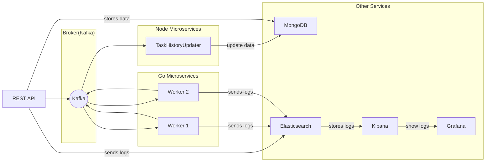
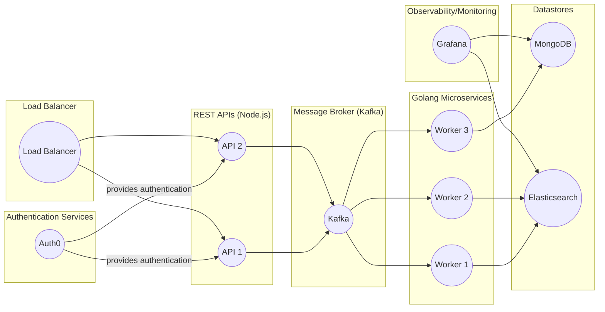

# Scalable and Fault-Tolerant Microservices Architecture Showcase

The objective of this project is to showcase the development of a scalable and fault-tolerant microservices architecture that can be easily deployed and managed. This project represents the first step towards implementing and improving a microservices architecture.

The architecture will consist of multiple microservices that will communicate with each other through a message broker. The Node.js microservices will handle the REST APIs while the Golang microservices will handle the processing of data. The objective of this project is to showcase the development of a scalable and fault-tolerant microservices architecture that can be easily deployed and managed.

Here a simplified diagram about current architecture schema:

## Propose

Through this project, we aim to demonstrate the benefits of a microservices architecture and highlight its potential for future development and improvement. Our ultimate goal is to create a robust, flexible, and efficient microservices architecture that can meet the evolving needs of our users and stakeholders.

By showcasing the development of this architecture, we hope to inspire further exploration and experimentation with microservices, as well as contribute to the wider conversation about the benefits and challenges of this architectural style.

## Current status

Currently, As a **gateway** is the **REST API** which manages the users and their access. In addition, this Rest API has the purpose of allowing to create and send tasks to the different microservices in Golang. The result of the tasks are managed by the microservice named "*TaskHistoryUpdater*" with the purpose of storing the result of the tasks in a persistent way. The communication between these microservices is done through a Kafka cluster. For more details see the following detailed diagram: [Detailed diagram](./docs/diagram_detail.md)

> The objective of this project is to showcase the development of a scalable and fault-tolerant microservices architecture that can be easily deployed and managed.

By utilizing both Node.js and Golang, this project aims to create a robust and efficient architecture that is capable of handling high volumes of traffic and processing large amounts of data. Through the use of a message broker, the microservices will be able to communicate with each other seamlessly, ensuring that the architecture is fault-tolerant and scalable.

## Usage

The project is being tested using a Docker Compose file that includes the following services:

- [**rest-api-node**](./node-rest-api/): A Node.js-based REST API that receives data from clients and publishes it to the "pending-tasks" topic in Kafka for processing by other microservices. 
- [**task-updater**](./node-task-updater/): A Node.js-based microservice that consumes the "task-completed" topic from Kafka and updates the task history in MongoDB.
- [**go-worker**](./go-worker/):  A Golang-based microservice that consumes the "pending-tasks" topic from Kafka, generates results, and publishes them to the "task-completed" topic in Kafka.
- **mongodb**: a document-oriented database used to store data for the microservices.
- **elasticsearch**: a distributed search and analytics engine used for logging and monitoring.
- **kibana**: a data visualization and exploration platform that works in conjunction with Elasticsearch to provide real-time analytics and insights.
- **grafana**: a platform used for monitoring and analytics, with support for data visualization, alerting, and dashboards.
- **zookeeper**: A centralized service for maintaining configuration information, naming, providing distributed synchronization, and group services for distributed systems. It is used to manage the Kafka cluster in this architecture.
- **kafka**: A distributed streaming platform that is used as a message broker in this architecture. It is used for messaging between the microservices.

These services are essential for the microservices architecture to function correctly and provide the observability and monitoring capabilities required. The Docker Compose file is available in the project repository, and each service can be accessed using the exposed ports.

> **Take into account .env files** (used to solve the dependencies between services).
> As this is a learning and testing purpose project, the .env files are kept in the repository. But it is always advisable for project **not upload** these files.

### About ElasticSearch

This service is launched with basic authentication (test), it's recommended ( for production) to have network encryption enabled, and a Kibana instance securely connected to it. There is official documentation on how to achieve this, as well as more information on elasticsearch and kibana images:

- [elasticsearch-docker](https://www.elastic.co/guide/en/elasticsearch/reference/current/docker.html)
- [configuring-stack-security](https://www.elastic.co/guide/en/elasticsearch/reference/7.15/configuring-stack-security.html?blade=kibanasecuritymessage#configuring-stack-security)

>**From Elastic Official Reference:**
>  Before you start serious development or go into production with Elasticsearch, review the [requirements and recommendations](https://www.elastic.co/guide/en/elasticsearch/reference/current/docker.html#docker-prod-prerequisites) to apply when running Elasticsearch in Docker in production.

### About Apache Kafka

In a microservices architecture, Kafka is often used as a messaging backbone to enable communication between various microservices. Each microservice can produce or consume messages from Kafka topics, which act as the intermediary between the microservices. This enables the microservices to be loosely coupled and allows for asynchronous communication.

This is a simplified diagram showing how kafka is deployed for this project (more info about it [Kafka on Docker](./docs/kafka_setup.md)):

> In this case only one broker has been deployed, but more could easily be deployed.

## Future improvements

In the future, the idea is implement other services and tools to help improve the current architecture:

- Improve Kafka (add Cluster). ([kafka-docker](https://www.architect.io/blog/2021-01-26/kafka-docker-tutorial/),[kafka-stack-docker-compose](https://github.com/conduktor/kafka-stack-docker-compose),[kafka-listeners-explained](https://rmoff.net/2018/08/02/kafka-listeners-explained/) )
- External Token Authentication Provider like [Auth0](https://auth0.com/docs)
- Implementing load balancing and horizontal scaling for the microservices to improve performance and handle increased traffic.
- Using Kubernetes to manage the deployment and scaling of microservices.
- Improving security by implementing authentication and authorization mechanisms for the APIs and services.
- Implementing automated testing and continuous integration/continuous deployment (CI/CD) pipelines.
- Using a caching layer, such as Redis, to improve the performance of the microservices architecture.

> Note: More useful info about kafka: [working-with-kafka](https://www.sohamkamani.com/golang/working-with-kafka/)

Here is a diagram showing an improved architecture with some of the points mentioned above:

