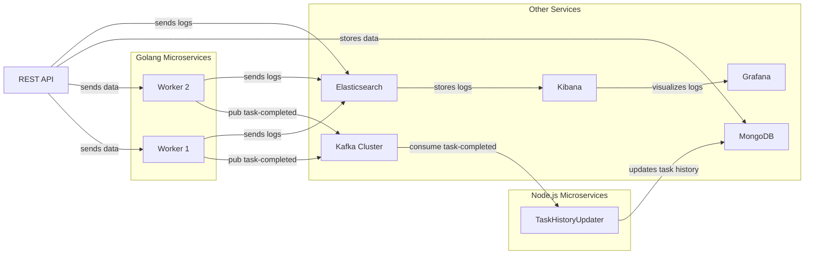

```mermaid
graph LR
N1[REST API]
subgraph Node.js Microservices
N2[TaskHistoryUpdater]
end

subgraph Golang Microservices
G1[Worker 1]
G2[Worker 2]
end

subgraph Other Services
M[MongoDB]
E[Elasticsearch]
K[Kibana]
G[Grafana]
KafkaCluster[Kafka Cluster]
end

N1 -- sends data --> G1
N1 -- sends data --> G2
G1 -- pub task-completed --> KafkaCluster
G2 -- pub task-completed --> KafkaCluster
KafkaCluster -- consume task-completed--> N2
N2 -- updates task history --> M
N1 -- stores data --> M
N1 -- sends logs --> E
G1 -- sends logs --> E
G2 -- sends logs --> E
E -- stores logs --> K
K -- visualizes logs --> G
```