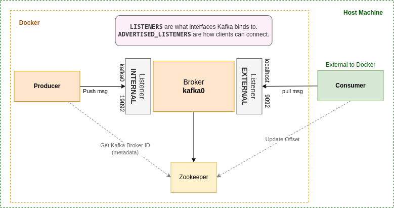

# Kafka on Docker

Kafka is a distributed streaming platform that is widely used in building real-time data pipelines and streaming applications. It allows applications to publish, subscribe, and process streams of records in a fault-tolerant, scalable, and reliable manner. Kafka is designed to handle high volume and velocity data streams, and it provides a publish-subscribe model with message persistence.

Here is a simplified diagram of the kafka deployment:



## Explanation of Kafka and Docker Compose setup

The Docker Compose file  sets up a Kafka cluster with one broker and a ZooKeeper instance for coordination. Here is a brief explanation of the configuration:

```yaml
zookeeper:
    image: wurstmeister/zookeeper
    hostname: zookeeper
    restart: always
    ports:
      - "2181:2181"
    ulimits:
      nofile:
        soft: 100000
        hard: 100000

  kafka0:
    image: wurstmeister/kafka
    restart: always
    hostname: kafka0
    ports:
      - '9092:9092'
      - '9999:9999'
    environment:
      KAFKA_ADVERTISED_HOST_NAME: kafka0
      KAFKA_LISTENERS: INTERNAL://kafka0:19092,EXTERNAL://kafka0:9092
      KAFKA_ADVERTISED_LISTENERS: INTERNAL://kafka0:19092,EXTERNAL://${DOCKER_HOST_IP:-127.0.0.1}:9092
      KAFKA_LISTENER_SECURITY_PROTOCOL_MAP: INTERNAL:PLAINTEXT,EXTERNAL:PLAINTEXT
      KAFKA_INTER_BROKER_LISTENER_NAME: INTERNAL
      KAFKA_BROKER_ID: 1
      KAFKA_LOG4J_LOGGERS: "kafka.controller=INFO,kafka.producer.async.DefaultEventHandler=INFO,state.change.logger=INFO"
      KAFKA_OFFSETS_TOPIC_REPLICATION_FACTOR: 1
      KAFKA_TRANSACTION_STATE_LOG_REPLICATION_FACTOR: 1
      KAFKA_TRANSACTION_STATE_LOG_MIN_ISR: 1
      KAFKA_JMX_PORT: 9999
      KAFKA_JMX_HOSTNAME: ${DOCKER_HOST_IP:-127.0.0.1}
      KAFKA_AUTHORIZER_CLASS_NAME: kafka.security.authorizer.AclAuthorizer
      KAFKA_ALLOW_EVERYONE_IF_NO_ACL_FOUND: "true"
      #KAFKA_ADVERTISED_PORT: 9092
      KAFKA_CREATE_TOPICS: "pending-tasks:1:1,completed-tasks:1:1"
      KAFKA_ZOOKEEPER_CONNECT: zookeeper:2181
    depends_on:
      - zookeeper

```

- **zookeeper**: This service sets up a ZooKeeper instance to coordinate the Kafka cluster. ZooKeeper is used to manage the Kafka brokers and keep track of the topic configurations, partition assignments, and other metadata.

- **kafka0**: This service sets up a Kafka broker with the following configurations:

  - **KAFKA_ADVERTISED_HOST_NAME**: This sets the hostname that the broker advertises to clients. In this case, it's set to kafka0.
  - **KAFKA_LISTENERS** and **KAFKA_ADVERTISED_LISTENERS**: These settings configure the network listeners for the broker. The broker listens on two endpoints: INTERNAL://kafka0:19092 for internal communication among the brokers and EXTERNAL://kafka0:9092 for external communication with clients. The advertised listeners setting tells clients how to connect to the broker.
  - **KAFKA_LISTENER_SECURITY_PROTOCOL_MAP**: This maps the listener names to security protocols. In this case, both listeners use the PLAINTEXT protocol, which means that no encryption is used.
  - **KAFKA_INTER_BROKER_LISTENER_NAME**: This sets the listener name used for internal communication between the brokers. In this case, it's set to INTERNAL.
  - **KAFKA_BROKER_ID**: This sets the broker ID for this instance. Each broker in a Kafka cluster should have a unique ID.
  - **KAFKA_OFFSETS_TOPIC_REPLICATION_FACTOR** and **KAFKA_TRANSACTION_STATE_LOG_REPLICATION_FACTOR**: These settings set the replication factor for the internal Kafka topics used for storing offset and transaction metadata. In this case, they are set to 1, which means that each partition of the topic is stored on a single broker.
  - **KAFKA_CREATE_TOPICS**: This sets up two Kafka topics with the names pending-tasks and completed-tasks. Each topic has one partition and one replica.
  - **KAFKA_ZOOKEEPER_CONNECT**: This sets the connection string for the ZooKeeper instance that the broker should use for coordination.

Check Kafka from Host Machine:

```bash
docker-compose exec kafka /opt/kafka/bin/kafka-topics.sh --list --bootstrap-server INTERNAL://kafka:19092
completed-tasks
pending-tasks
```
