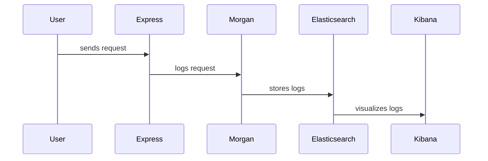
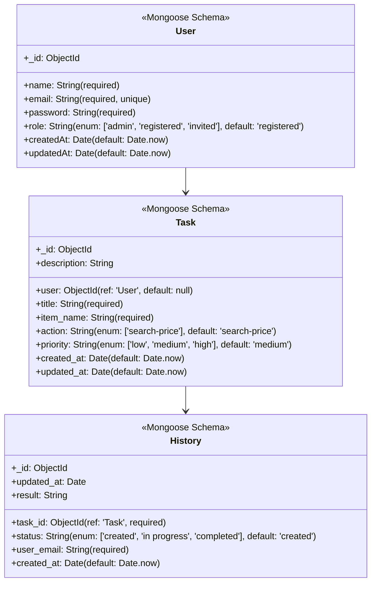
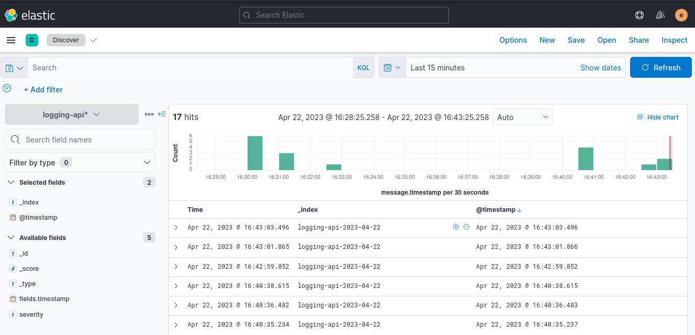
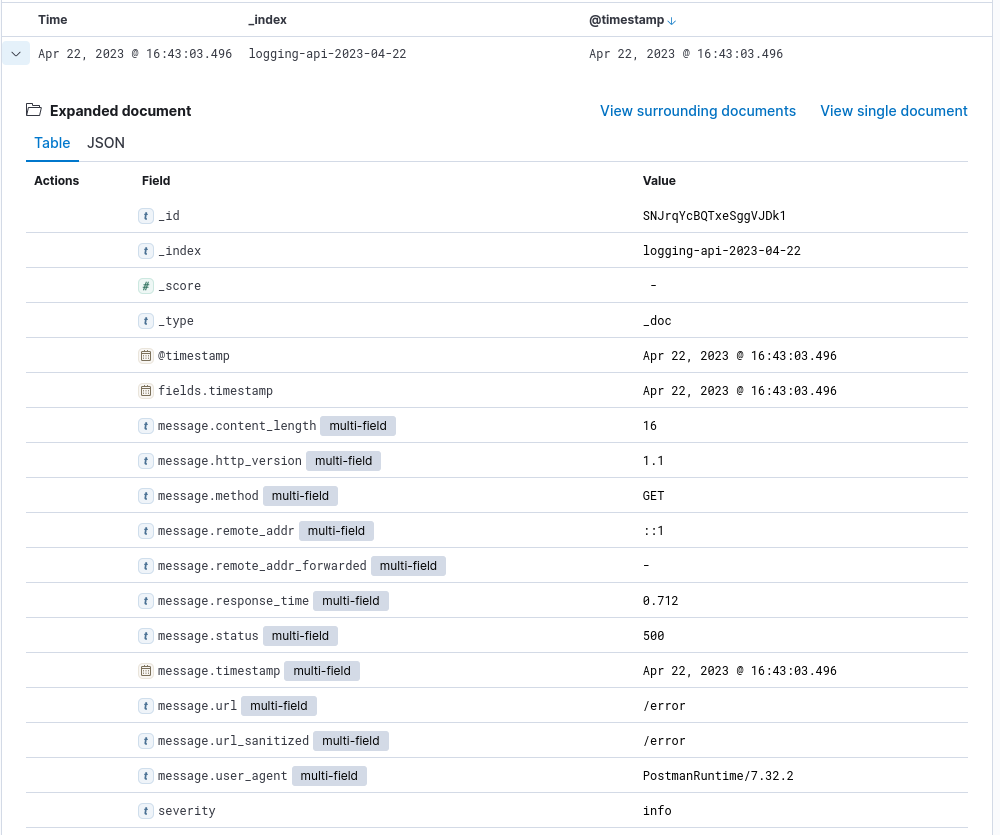

# Project Overview

This project is a Node.js-based REST API that utilizes various packages to implement security, database connectivity, logging, API documentation, and observability. The objective of this project is to showcase the first step towards implementing a robust REST API that incorporates best practices for developing, deploying, and maintaining a production-grade API.

## Tools and Libraries Used

The following tools and libraries were used in this project:

- Node.js: A JavaScript runtime that allows developers to build scalable network applications.
- Express: A fast, minimalist web framework for Node.js that simplifies the creation of web applications.
- bcryptjs: A library that allows for secure password hashing.
- jsonwebtoken: A library that enables token-based authentication.
- mongoose: A MongoDB object modeling tool designed to work in an asynchronous environment.
- dotenv: A zero-dependency module that loads environment variables from a .env file.
- morgan: A HTTP request logger middleware for Node.js.
- swagger-jsdoc: A library that allows for the use of JSDoc annotations to generate Swagger documentation.
- swagger-ui-express: A library that provides a web-based interface for Swagger documentation.
- winston-elasticsearch: A library that allows for logging to Elasticsearch using Winston.

## Utility (Summary)

This REST API project showcases the following features:

- User authentication using token-based authentication.

- Password hashing for enhanced security.

- Database connectivity using MongoDB and Mongoose.

- API documentation using Swagger.

- HTTP request logging using Morgan.

- Observability using Winston logging to Elasticsearch.

## Clean Architecture and its Advantages

This project uses the Clean Architecture approach, which is a software design philosophy that emphasizes the separation of concerns and decoupling of the application's layers. The advantages of using Clean Architecture include:

- Modular and maintainable code.

- Improved testability of the codebase.

- Scalability and extensibility of the application.

- Easier adoption of new technologies or frameworks.

## Observability and Monitoring

In this case, it's used Morgan, a request logger middleware for Node.js to use in combination with Express, to create access logs, send them to an Elasticsearch database and visualize reports with Kibana.



## Requirements

- Node.js (v10 or later)
- NPM package manager
- Docker
- Docker Compose

## Installation (Local)

1. Clone the repository to your local machine.

2. Navigate to the project directory in the terminal.

3. Install the dependencies by running `npm install`.

4. Create a `.env` file in the root directory of the project with the following variables:

   ```bash
   NODE_ENV=development # or production
   PORT=3000
   MONGO_URL=mongodb://mongo:27017/rest-api
   ELASTICSEARCH_URL=http://elasticsearch:9200
   JWT_SECRET=mysecretkey
   ADMIN_EMAIL=""
   ADMIN_PASSWORD=""
   ADMIN_NAME=""
   GRAFANA_HOST=""
   ```

5. Launch Docker Compose to deploy MongoDB and Elasticsearch:

   ```bash
   docker-compose up -d
   ```

To compile your project using webpack, you can run the command `npm run build` which runs the webpack command using the configuration file `webpack.config.js`.

> Note: Regarding the webpack.config.js file, it specifies the entry point (server.js), the output file (bundle.js), the target environment (node), and the rules to be used to process the source files. In this case, it uses the babel-loader to transpile the code from ES6 to ES5 using the @babel/preset-env preset.

## Usage

### Running the Server

#### Local

To start the server, run the following command in the terminal:

```bash
npm start #Read .env by default
# or
source .env_local && npm run local #Read ENVs from terminal
```

This will start the server on port 3000. You can change the port by setting the `PORT` environment variable in the `.env` file. It's also an option to create a build via [webpack](https://www.npmjs.com/package/webpack) using the below command:

```bash
npm run build
node ./dist/build.js 
```

#### Container

It's also possible to use Docker for use rest-api easier. In this case, there is a script named `run-rest-api-container.sh` to manage an individual container (build,start,stop and delete):

```bash
node-rest-api$ ./run-rest-api-container.sh 
In what state you want to build the container?
1. Development
2. Production
3. Ignore
2
[+] Building 0.6s (12/12) FINISHED                                                                                                                                                                                                                                                  
What do you want to do?
1. Start container
2. Stop container
3. Delete container and image
4. Exit
1
The container (rest-api-container):(26ddb71651e9bfb3c9d6334bd57ae7075b340fe6b41fa36944c5e35798e1b6b4) has been started.
```

> Note: Depending where is located mongoDB and another service like ElasticSearch, may modify the appropriate environment variables

#### Postman

[Postamn](https://www.postman.com/) is a popular collaboration platform for API development, testing, and documentation. It provides a user-friendly interface for making HTTP requests to APIs and analyzing their responses. With Postman, developers can easily create and share collections of API requests, collaborate with team members, and automate API testing.

There is a Postman Collection inside of `./docs/postman/`folder. A JSON file that contains a set of API requests and associated metadata. It can be created within Postman or imported/exported as a file. Collections allow developers to organize and group together related requests for a particular API or project.

### Authentication

Authentication is required for some API endpoints. The authentication is done using JSON Web Tokens (JWTs). To generate a JWT, send a `POST` request to the `/api/login` endpoint with a JSON payload containing the `username` and `password` that current exist.

```bash
POST /api/login HTTP/1.1
Content-Type: application/json

{
    "username": "myusername",
    "password": "mypassword"
}

```

### Class Diagrams

Once the user is logged in, it's possible to use JWT to interact with the API. In this case, allowing to manage our Tasks and launch them. Launching a Task generates a History with the status and result of the launched Task. Here is an overview of the class diagrams of the models used:



> Note: These models are stored in MongoDB. In addition, these models are test models, being possible to modify them, for example to better specify the Task classes to better match the task to be realized.

### Documentation

Swagger has been used to generate this documentation, creating standardized API specifications in a format such as OpenAPI, which can be easily shared with developers and clients. To access the Swagger web and view the API documentation and available routes, you can navigate to the API's base URL and append "/api-docs" to the end of the URL.

```bash
curl --location 'http://localhost:3000/api-docs'
```

### Monitoring

There are some endpoints with a test purpose to add logs to check through Kibana, here are some screenshots from Kibana showing the logs about the generated  requests via Postman to end-point `/success` and `/error`:




